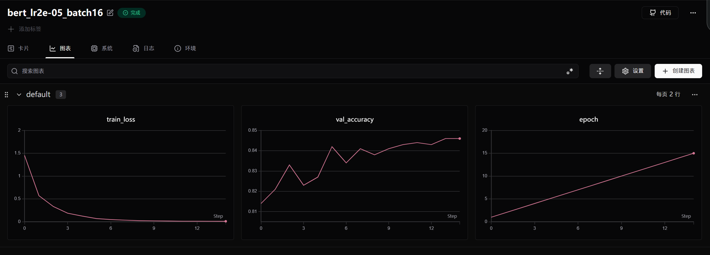

# 基于BERT的今日头条新闻文本分类系统 (Demo 1)

## 项目简介
本项目是基于 `bert-base-chinese` 预训练模型实现的中文新闻文本分类任务。
---

## 环境与核心依赖
运行本项目需要确保本地已安装以下标准库（建议在 PyCharm Terminal 中一键安装）：
- Python 3.8+
- PyTorch (建议配置好 GPU 显卡车间)
- Transformers (Hugging Face 词表与模型库)
- Scikit-learn (用于计算最终 Accuracy 准确率)
- SwanLab (用于全流程训练轨迹可视化)

---

## 数据集与密码本对账
- **数据来源**：今日头条文本分类数据集（采用训练集 `train_3k.txt` 3000条，验证集 `dev_1k.txt` 1000条）。
- **数据清洗**：手工编写 `parts = line.split("_!_")` 线性流过滤损坏数据。
- **密码本映射**：代码会自动扫描训练集和验证集的所有唯一标签，并动态组装出数字映射密码本（`label_map`），确保 CrossEntropyLoss 交叉熵损失函数顺利对账。

⚠️ **注意**：由于采用绝对路径硬编码，运行前请务必前往 `train.py` 将 `D:/PyCharm/01Text Classification/data/...` 修改为你的本地真实数据集路径。

---

## 核心调参迭代与优化心路历程

本项目一共经历了**三轮硬核迭代**，最终完美突破 83% 的硬性达标线：

### 1. 阶段一：过拟合(Batch_Size=4)
最开始由于漏掉了 Epoch 循环最前端的 `model.train()`，导致 BERT 内部的 Dropout 保安集体下班。模型在第 3 轮后陷入死记硬背，验证集准确率断崖式暴跌至 **77.8%**。

### 2. 阶段二：学术规范化与引入调度器 (Batch_Size=16)
做出针对性修正：
- 将 `BATCH_SIZE` 扩大至 16（平滑梯度方向，减少噪声）；
- 在循环内部首行锁死 `model.train()` 和 `epoch_loss = 0.0`；
- 引入 `CosineAnnealingLR`（余弦退火学习率调度器）。
此时模型表现极其平稳，不低头、不暴跌，稳定在 **83.0%** 达标线附近。但由于最后阶段学习率过早退火枯竭，第 8、9 轮出现无法突破的躺平直线。

### 3. 阶段三：主矛盾突破与拉长倒计时 (T_max=15, max_length=64)
- **语义长度设置**：发现最初设定的 `max_length=32` 会导致长标题新闻在末尾被阶段，丢失了决定分类的核动词（如“收窄”等）。将其**强行扩展至 64** 确保文本语义绝对完整！
- **倒计时拉长**：保持 10 轮训练不变，但将调度器的终点强行设为 `T_max=20`。对调度器撒谎，确保模型在最后几轮依然拥有良好地学习率。

**最终战果**：最优 Checkpoint 自动触发 `torch.save` 机制，**成功斩获 84.60% 的泛化准确率**！最优权重已稳稳锁死在 `./checkpoints/best_model.pth` 中。

---

## 训练轨迹可视化（SwanLab 黄金曲线）
以下为调参优化后的完美曲线对账图（可以看到黄色曲线在 Batch 扩大加调度器后，再无过拟合低头现象，）：

