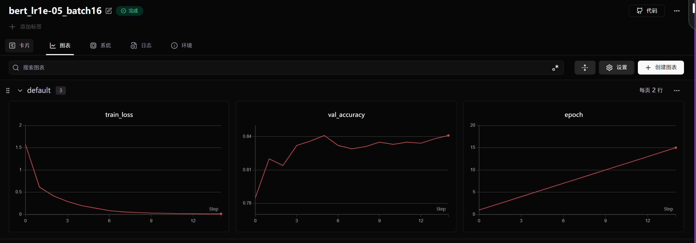

# Text-classification-task（基于BERT的自定义中文文本分类微调）
本项目实现了一个基于深度学习的中文短文本多分类功能。实验BERT预训练模型，通过在上层叠加线性分类全连接层，对今日头条的新闻文本进行有监督的微调训练。
系统最终能够根据输入的新闻文本，自动将其归类到指定的15个业务标签（如体育、汽车、财经、游戏等）中的某一个。
整个项目实现了原始文本切分、特征组装、训练集微调、SwanLab训练图像表现，到最后测试集完全隔离的完整工程。

## 一、项目系统结构
```text
    --- Text-classification-task/
    --- DATA/                   # 数据集文件夹
    |—— ---train_3k.txt            # 训练集（3000条新闻数据）
    |—— ---dev_3k.txt              # 验证集（3000条新闻数据）
    |—— ---test_1k.txt             # 测试集（1064条新闻数据）
    --- config.json.example        # 配置文件
    --- model.py                   # 基于bert的模型定义
    --- test.py                    # 独立的测试脚本
    --- train.py                   # 核心训练循环脚本
    --- main.py                    # 整个项目的启动脚本
    --- README.md                  # 项目说明文档
    --- requirements.txt           # 项目依赖描述文件
```
## 二、实验环境
操作系统：Windows

开发工具：PyCharm / Anaconda / Python 3.10

核心依赖库：PyTorch, Transformers, Scikit-Learn, SwanLab
## 三、数据集简介与处理说明
1. 原始数据格式
数据集里的每行新闻都用 _!_ 符号隔开，标准的字段顺序如下：
新闻ID _!_ 分类代码 _!_ 分类名称 _!_ 新闻标题 _!_ 新闻关键词

本项目涉及的 15 个分类代码分别是：

100 故事 / 101 文化 / 102 娱乐 / 103 体育 / 104 财经

106 房产 / 107 汽车 / 108 教育 / 109 科技 / 110 军事

112 旅游 / 113 国际 / 114 证券 / 115 农业 / 116 游戏

2. 数据处理与防崩溃设计
在 dataset.py 中，主要对数据做了以下处理：

不规范数据过滤：针对网络下载或传输时可能产生的残缺、断行等不规范数据，用 try...except 进行了拦截，发现残缺行直接跳过，防止训练中途报错崩溃。

统一编号对齐：将固定的15分类标准列表放至config.json进行统一管理。所有数据集在换算数字标签时，对应的都是一模一样的固定编号，防止因为个别分类缺失导致编号错位。

条件特征拼接：在dataset.py中加入了is_keyword条件开关。当开关开启且数据包含关键词时，系统会自动将“新闻标题”与“新闻关键词”拼接输入，从而获得更多长文本的特征信息。
## 四、代码运行流程
1. 第一步：开始训练模型
在 PyCharm 终端或直接运行 main.py 脚本  
程序启动后会读取config.json 里的参数，并连接初始化SwanLab看板。模型会加载本地或Hugging Face的bert-base-chinese预训练权重开始学习。
每一轮（Epoch）训练结束后，程序会自动读取 data/dev_3k.txt 验证集对当前模型进行全面考试。如果发现这一轮的验证集准确率破了历史纪录，系统就会把当前最新的模型权重覆盖保存到 checkpoints/best_checkpoint.pt，确保留下的一定是效果最好的。
2. 第二步：在独立测试集上测试
训练全部结束后，在终端运行 inference.py 脚本进行测试  
这个脚本会完全独立启动，自动去加载刚刚训练时保存好的 best_checkpoint.pt 权重。然后把从来没有参与过训练、也没有参与过验证的1064条独立测试集数据（data/test_1k.txt）送进模型进行预测，最后和正确答案做对比，计算出最终的全局准确率。
## 五、实验最终结果
运行测试脚本 inference.py 后，控制台最终输出的真实数据如下：  
测试集有效样本总数：1064 条  
模型预测正确样本数：900 条  
测试集最终准确率 (Accuracy)：84.59%

结果简析  
模型在训练期间的dev_3k.txt验证集上拿到的最高准确率是86.60%而在test_1k.txt测试集上达到84.59%。

## 六、训练轨迹可视化
以下为调参优化后的曲线：

